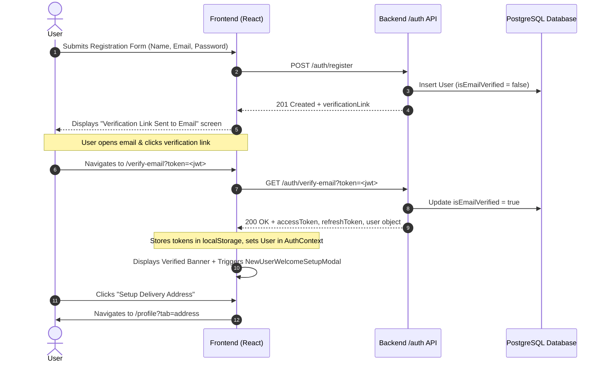
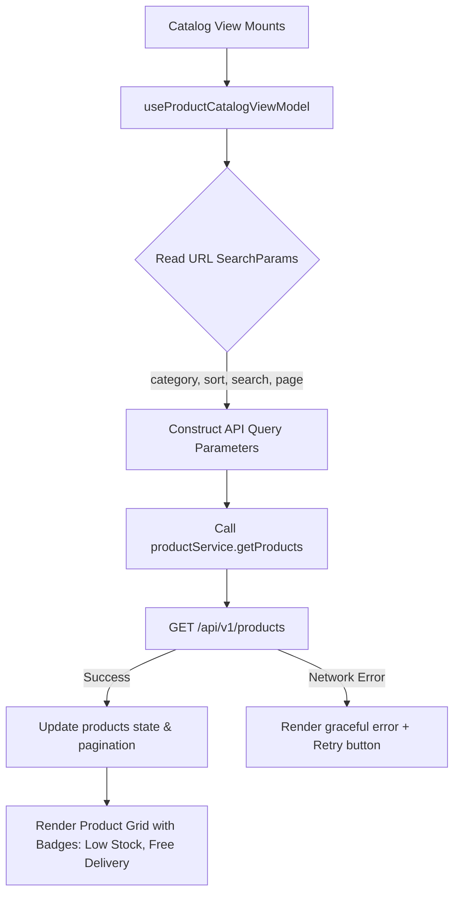

# FiddleMania E-Commerce Platform — Comprehensive System Documentation

> **Version:** 1.0.0  
> **Last Updated:** September 2026  
> **Repository:** `ae-b4-grp-01-prj-01-fe`  
> **Target Framework:** React 18+ (Vite) / RESTful Backend API (Vercel) / PostgreSQL  

---

## Table of Contents

1. [Executive Summary & System Overview](#1-executive-summary--system-overview)
2. [Technology Stack & Architectural Principles](#2-technology-stack--architectural-principles)
3. [Project Directory & File Structure](#3-project-directory--file-structure)
4. [Frontend-Backend Communication Layer](#4-frontend-backend-communication-layer)
   - [Axios Instance & Interceptors](#41-axios-instance--interceptors)
   - [Authentication & Bearer Token Injection](#42-authentication--bearer-token-injection)
   - [Silent Token Refresh & Session Rotation](#43-silent-token-refresh--session-rotation)
   - [Response Envelope Unwrapping & Error Handling](#44-response-envelope-unwrapping--error-handling)
5. [Complete REST API Contract & Catalog](#5-complete-rest-api-contract--catalog)
   - [Auth & Identity API](#51-auth--identity-api)
   - [Product Catalog & Categories API](#52-product-catalog--categories-api)
   - [Customer Addresses API](#53-customer-addresses-api)
   - [Cart, Checkout & Orders API](#54-cart-checkout--orders-api)
   - [Payments & Webhooks API](#55-payments--webhooks-api)
   - [Shipment & Logistics Tracking API](#56-shipment--logistics-tracking-api)
   - [Admin Executive BI & Inventory Management API](#57-admin-executive-bi--inventory-management-api)
6. [Core Workflows & Lifecycle Diagrams](#6-core-workflows--lifecycle-diagrams)
   - [6.1 User Registration, Email Verification & Setup Flow](#61-user-registration-email-verification--setup-flow)
   - [6.2 Session Initialization & Auto-Login Flow](#62-session-initialization--auto-login-flow)
   - [6.3 Product Browsing, Search & Filtering Flow](#63-product-browsing-search--filtering-flow)
   - [6.4 Cart & Checkout Tunnel Flow](#64-cart--checkout-tunnel-flow)
   - [6.5 Delivery Address Isolation Architecture](#65-delivery-address-isolation-architecture)
   - [6.6 Admin Fulfillment & Inventory Restocking](#66-admin-fulfillment--inventory-restocking)
7. [Frontend Architecture & MVVM Implementation](#7-frontend-architecture--mvvm-implementation)
   - [State Management (`AuthContext` & `CartContext`)](#71-state-management-authcontext--cartcontext)
   - [Model-View-ViewModel (MVVM) Pattern](#72-model-view-viewmodel-mvvm-pattern)
   - [Routing & Access Guards (`AdminGuard` & `CustomerGuard`)](#73-routing--access-guards-adminguard--customerguard)
8. [Storage Key Registry & Data Integrity](#8-storage-key-registry--data-integrity)
9. [Environment Configuration & Deployment](#9-environment-configuration--deployment)

---

## 1. Executive Summary & System Overview

**FiddleMania** is a high-performance, responsive e-commerce web application engineered for collectors and enthusiasts of mechanical puzzles, tactile fidget toys, artisan desk novelties, and STEM kinetic figures.

The system is organized into two primary user personas:
1. **Customer Storefront:** Enables shoppers to discover curated toys, view real-time stock levels, submit verified product reviews, maintain shopping carts, complete checkout with carbon-neutral delivery, and track live order shipments.
2. **Executive & Administrative Portal:** Provides warehouse managers and business executives with real-time business intelligence (revenue, sales trends, average order value), live inventory monitoring with low-stock alerts, restock actions conforming to ERD warehouse schemas, and order fulfillment state transitions.

```
+-------------------------------------------------------------------------------+
|                             FIDDLEMANIA SYSTEM                                |
+---------------------------------------+---------------------------------------+
|          CUSTOMER STOREFRONT          |             ADMIN PORTAL              |
|   - Product Catalog & Filters         |   - Executive BI Reports & Sales      |
|   - Cart & Express Checkout           |   - Warehouse Inventory & Restock     |
|   - User Profile & Address Manager    |   - Order Fulfillment Transitions     |
|   - Order Tracking & Tax Receipts     |   - Role-Guarded Access Control       |
+---------------------------------------+---------------------------------------+
                                    |
                    [Axios HTTP Client + Interceptors]
                                    |
                                    v
+-------------------------------------------------------------------------------+
|                       VERCEL REST API (Node.js / Express)                     |
|                   Base URL: /api/v1 (PostgreSQL Database)                     |
+-------------------------------------------------------------------------------+
```

---

## 2. Technology Stack & Architectural Principles

### 2.1 Technology Stack
* **Frontend Framework:** React 18+ powered by Vite 8 for fast Hot Module Replacement (HMR) and optimized build bundling.
* **Routing:** `react-router-dom` v6 with nested routes, client-side redirection interceptors, and strict authentication/role guards.
* **State Management:** React Context API (`AuthContext`, `CartContext`) paired with localized ViewModel state (`useState`, `useEffect`, `useCallback`).
* **HTTP Client:** `axios` featuring global request/response interceptors, automatic JWT injection, and transparent 401 refresh token rotation.
* **Icons & Assets:** `lucide-react` for iconography; CSS-in-JS and custom SVG animations.
* **Styling & Aesthetics:** Pure Vanilla CSS Design System with custom tokens (`--accent`, `--text-main`, `--bg-main`, `--card-bg`), soft glassmorphism, responsive elevation shadows, and mobile drawer affordances.

### 2.2 Core Architectural Principles
* **Separation of Concerns (MVVM):** Business rules, validations, and API interactions reside in ViewModels and Services; presentation remains purely declarative in Views and Components.
* **Graceful Degradation / Resilience:** Every critical service call includes defensive fallbacks (e.g., local tax/shipping calculation if the summary service is momentarily unreachable; fallback categories if network drops).
* **Identity Isolation:** Storage keys containing customer addresses or cart metadata are scoped strictly per authenticated user identity to prevent cross-account data bleeding in shared browser sessions.

---

## 3. Project Directory & File Structure

```
ae-b4-grp-01-prj-01-fe/
├── public/                     # Static media and favicons
├── src/
│   ├── context/                # Global State Providers
│   │   ├── AuthContext.jsx     # User identity, JWT persistence, login, logout, addresses
│   │   └── CartContext.jsx     # Cart items, item counts, subtotal calculations
│   │
│   ├── services/               # Backend API Communication Layer
│   │   ├── api.js              # Axios instance, request & response interceptors, refresh flow
│   │   ├── adminService.js     # BI metrics, admin orders, warehouse restock endpoints
│   │   ├── productService.js   # Products, categories, and single product fetchers
│   │   ├── orderService.js     # Checkout summary, order creation, order queries
│   │   ├── orderSync.js        # Cross-window order status synchronization & ERD statuses
│   │   ├── paymentService.js   # Payment Intent generation & simulated webhook triggers
│   │   ├── shipmentService.js  # Tracking number lookup and shipping milestones
│   │   └── reviewService.js    # Customer product reviews and rating submission
│   │
│   ├── shared/                 # Reusable Application Chrome & Guards
│   │   ├── components/
│   │   │   ├── Navbar.jsx          # Top navigation with live cart badge & search
│   │   │   ├── Footer.jsx          # Storefront links, newsletter, compliance
│   │   │   ├── CartDrawer.jsx      # Slide-out interactive bag
│   │   │   ├── CartToast.jsx       # Floating feedback upon adding items
│   │   │   ├── BackToTop.jsx       # Circular scroll-to-top indicator
│   │   │   ├── AdminGuard.jsx      # Restricts /admin routes to role === 'ADMIN'
│   │   │   ├── AdminLayout.jsx     # Admin sidebar navigation and header chrome
│   │   │   └── CustomerGuard.jsx   # Redirects admin users away from storefront
│   │
│   ├── features/               # Domain-Driven Feature Modules (MVVM)
│   │   ├── auth/               # Login, Register, VerifyEmail, ResetPassword, WelcomeModal
│   │   ├── product-catalog/    # Catalog listing, filters, detail view, reviews
│   │   ├── cart/               # Full-page cart and item quantity management
│   │   ├── checkout/           # Multi-step checkout tunnel & payment simulator
│   │   ├── order-history/      # Customer order list, order confirmation, print receipt
│   │   ├── profile/            # Personal details, addresses management, security
│   │   ├── shipment-tracking/  # Real-time logistics tracking timeline
│   │   ├── support/            # FAQ accordion, contact support, legal policies
│   │   ├── admin-reports/      # Executive BI sales overview & analytics charts
│   │   ├── admin-inventory/    # Product catalog management, stock levels & restock modal
│   │   └── admin-fulfillment/  # Admin order queues & status transitions
│   │
│   ├── App.jsx                 # Routing declaration, global providers & redirect interceptor
│   ├── main.jsx                # React root bootstrap
│   └── index.css               # Global typography, color tokens, and utility classes
│
├── FIDDLEMANIA_LOVABLE_PROMPT.md# Product requirements document & UX specification
├── SYSTEM_DOCUMENTATION.md     # This comprehensive system guide
├── vite.config.js              # Vite bundler configuration
└── package.json                # Project dependencies and npm scripts
```

---

## 4. Frontend-Backend Communication Layer

The frontend communicates with the backend exclusively via an Axios client configured in [`src/services/api.js`](file:///d:/xampp_latest/htdocs/sandbox/ae-b4-grp-01-prj-01-fe/src/services/api.js). All requests target the base URL defined in `import.meta.env.VITE_API_URL` (defaulting to `https://ae-b4-grp-01-prj-01-be.vercel.app/api/v1`).

```
                                      +-------------------------------+
                                      |         React View /          |
                                      |          ViewModel            |
                                      +---------------+---------------+
                                                      |
                                                      v  api.get() / api.post()
                                      +-------------------------------+
                                      |      Axios Request Hook       |
                                      |   - Read accessToken from     |
                                      |     localStorage              |
                                      |   - Attach Authorization:     |
                                      |     Bearer <token>            |
                                      +---------------+---------------+
                                                      |
                                                      v  HTTP Request
                                      +-------------------------------+
                                      |       Vercel Backend API      |
                                      |         (Express/Node)        |
                                      +---------------+---------------+
                                                      |
                                                      v  HTTP Response
+-----------------------------------------------------+-----------------------------------------------------+
|                                            Axios Response Interceptor                                     |
|  Status 200/201:                                                        Status 401:                       |
|  Unwrap response.data.data -> Return payload                            Attempt POST /auth/refresh-token  |
|                                                                         Success: Resend original request  |
|                                                                         Fail: Purge tokens & prompt login |
+-----------------------------------------------------------------------------------------------------------+
```

### 4.1 Axios Instance & Interceptors

```javascript
// src/services/api.js
import axios from 'axios';

const api = axios.create({
  baseURL: import.meta.env.VITE_API_URL,
});
```

### 4.2 Authentication & Bearer Token Injection
Every outgoing request automatically reads the stored `accessToken` from `localStorage` and appends it to the HTTP headers:

```javascript
api.interceptors.request.use((config) => {
  const token = localStorage.getItem('accessToken');
  if (token) config.headers.Authorization = `Bearer ${token}`;
  return config;
});
```

### 4.3 Silent Token Refresh & Session Rotation
When an access token expires, the backend responds with HTTP status `401 Unauthorized`. The response interceptor transparently catches this error, requests a new access token using the stored `refreshToken`, updates local storage, updates the authorization header, and retries the original request without user disruption:

```javascript
api.interceptors.response.use(
  (response) => {
    if (response.data?.success) return response.data.data;
    return Promise.reject(response.data);
  },
  async (error) => {
    const original = error.config;
    const isAuthEndpoint =
      original?.url?.includes('/auth/login') ||
      original?.url?.includes('/auth/register');

    if (error.response?.status === 401 && !original._retry && !isAuthEndpoint) {
      original._retry = true;
      try {
        const refreshToken = localStorage.getItem('refreshToken');
        const res = await axios.post(
          `${import.meta.env.VITE_API_URL}/auth/refresh-token`,
          { refreshToken }
        );
        const newToken = res.data.data.accessToken;
        localStorage.setItem('accessToken', newToken);
        original.headers.Authorization = `Bearer ${newToken}`;
        return api(original);
      } catch {
        localStorage.removeItem('accessToken');
        localStorage.removeItem('refreshToken');
        localStorage.removeItem('fiddlemania_user');
      }
    }
    return Promise.reject(error.response?.data || error);
  }
);
```

### 4.4 Response Envelope Unwrapping & Error Handling
Backend endpoints return responses structured in the standard API envelope:
```json
{
  "success": true,
  "data": { ... }
}
```
The interceptor unpacks `response.data.data` directly, so frontend ViewModels and Services receive clean domain data without needing repeated `.data.data` indexing. If `success: false`, it rejects the promise with the standardized error object:
```json
{
  "success": false,
  "error": {
    "code": "ERROR_CODE",
    "message": "User-friendly description"
  }
}
```

---

## 5. Complete REST API Contract & Catalog

### 5.1 Auth & Identity API

| Method | Endpoint | Description | Auth Required | Request Body / Query | Expected Response Data |
| :--- | :--- | :--- | :--- | :--- | :--- |
| `POST` | `/auth/register` | Register a new customer account | No | `{ email, password, name }` | `{ message, verificationLink }` |
| `GET` | `/auth/verify-email` | Verify email via registration token | No | Query: `?token=<jwt>` | `{ user, accessToken, refreshToken }` |
| `POST` | `/auth/login` | Authenticate customer or administrator | No | `{ email, password }` | `{ user, accessToken, refreshToken }` |
| `GET` | `/auth/me` | Fetch active authenticated session | Yes (Bearer) | None | `{ user: { userId, email, name, role, ... } }` |
| `POST` | `/auth/refresh-token`| Rotate expired access token | No | `{ refreshToken }` | `{ accessToken }` |
| `POST` | `/auth/forgot-password`| Request password reset link | No | `{ email }` | `{ message, resetLink }` |
| `POST` | `/auth/reset-password` | Update account password via reset token | No | `{ token, newPassword }` | `{ message }` |
| `POST` | `/auth/change-password`| Change password from profile tab | Yes (Bearer) | `{ currentPassword, newPassword }` | `{ message }` |

### 5.2 Product Catalog & Categories API

| Method | Endpoint | Description | Auth Required | Request Body / Query | Expected Response Data |
| :--- | :--- | :--- | :--- | :--- | :--- |
| `GET` | `/categories` | Fetch all product categories | No | None | `[ { id, name, slug, description } ]` |
| `GET` | `/products` | Filter, search and paginate products | No | `?page=&limit=&category=&search=&minPrice=&maxPrice=&sort=` | `{ products: [ ... ], pagination: { ... } }` |
| `GET` | `/products/:idOrSlug` | Fetch full details for a product | No | None | `{ product: { id, name, price, stockQuantity, ... } }` |
| `GET` | `/products/:id/reviews`| Fetch customer reviews for a product | No | None | `[ { id, rating, title, comment, authorName, createdAt } ]` |
| `POST` | `/products/:id/reviews`| Post a verified product review | Yes (Bearer) | `{ rating, title, comment }` | `{ reviewId, rating, createdAt }` |

### 5.3 Customer Addresses API

| Method | Endpoint | Description | Auth Required | Request Body | Expected Response Data |
| :--- | :--- | :--- | :--- | :--- | :--- |
| `GET` | `/addresses` | Fetch saved delivery addresses for user | Yes (Bearer) | None | `[ { addressId, recipientName, phone, addressLine1, addressLine2, city, stateProvince, postalCode, country, isDefaultShipping } ]` |
| `POST` | `/addresses` | Create a new delivery address | Yes (Bearer) | `{ recipientName, phone, addressLine1, addressLine2, city, stateProvince, postalCode, country, isDefault }` | Created address object with `addressId` |
| `PUT` | `/addresses/:id` | Update an existing delivery address | Yes (Bearer) | `{ recipientName, phone, addressLine1, addressLine2, city, stateProvince, postalCode, country, isDefault }` | Updated address object |

### 5.4 Cart, Checkout & Orders API

| Method | Endpoint | Description | Auth Required | Request Body | Expected Response Data |
| :--- | :--- | :--- | :--- | :--- | :--- |
| `POST` | `/orders/checkout-summary`| Compute server-authoritative tax and shipping | Optional | `{ items: [ { productId, quantity, price } ] }` | `{ subtotal, shippingFee, taxAmount, total }` |
| `POST` | `/orders` | Submit new order & reserve inventory | Optional (Guest/User)| `{ items, shippingAddress, paymentMethod, totalAmount, ... }` | `{ orderId, orderNumber, status, createdAt, ... }` |
| `GET` | `/orders` | Retrieve authenticated customer's orders | Yes (Bearer) | None | `[ { orderId, orderNumber, status, totalAmount, createdAt, items } ]` |
| `GET` | `/orders/:orderId` | Retrieve single order details | Optional (Bearer/Token)| None | `{ orderId, orderNumber, status, items, shippingAddress, ... }` |
| `GET` | `/orders/:orderId/receipt`| Generate formal printable tax receipt | Optional | None | Receipt breakdown object |

### 5.5 Payments & Webhooks API

| Method | Endpoint | Description | Auth Required | Request Body | Expected Response Data |
| :--- | :--- | :--- | :--- | :--- | :--- |
| `POST` | `/payments/create-intent`| Create payment intent & transaction ref | Optional | `{ amount, currency, orderId }` | `{ transactionReference, clientSecret, status }` |
| `POST` | `/payments/webhook` | Simulated payment gateway webhook | No | `{ event, transactionReference, status }` | `{ success: true, orderStatus: 'PROCESSING' }` |

### 5.6 Shipment & Logistics Tracking API

| Method | Endpoint | Description | Auth Required | Request Body / Params | Expected Response Data |
| :--- | :--- | :--- | :--- | :--- | :--- |
| `GET` | `/shipments/track/:trackingNumber` | Public shipment tracking by tracking number | No | Param: `trackingNumber` | `{ trackingNumber, status, carrier, milestones: [ ... ] }` |
| `GET` | `/shipments/:orderId` | Customer shipment status by order ID | Optional | Param: `orderId` | `{ orderId, trackingNumber, status, estimatedDelivery }` |

### 5.7 Admin Executive BI & Inventory Management API

| Method | Endpoint | Description | Auth Required | Request Body / Query | Expected Response Data |
| :--- | :--- | :--- | :--- | :--- | :--- |
| `GET` | `/admin/reports/overview` | Executive BI dashboard summary metrics | Admin (Bearer) | `?preset=30d` or `?startDate=&endDate=` | `{ totalRevenue, totalOrders, averageOrderValue, salesByDay, categoryDistribution }` |
| `GET` | `/admin/orders` | Queue of all customer orders | Admin (Bearer) | `?page=&limit=&status=` | `{ orders: [ ... ], pagination: { ... } }` |
| `GET` | `/admin/orders/:orderId` | Admin inspection of order & customer | Admin (Bearer) | Param: `orderId` | Full order object with customer metadata |
| `PUT` | `/admin/orders/:orderId/status`| Transition order fulfillment status | Admin (Bearer) | `{ status: 'CONFIRMED'|'SHIPPED'|'DELIVERED'|'CANCELLED' }` | `{ orderId, status }` |
| `GET` | `/admin/products` | Admin inventory overview with stock levels | Admin (Bearer) | `?limit=100` | List of products with inventory metrics |
| `POST` | `/inventories/restock` | Restock warehouse physical inventory | Admin (Bearer) | `{ productId, restockQuantity, currentStock }` | `{ inventoryId, stockQuantity, updatedStock }` |

---

## 6. Core Workflows & Lifecycle Diagrams

### 6.1 User Registration, Email Verification & Setup Flow



### 6.2 Session Initialization & Auto-Login Flow

When a user visits or refreshes the page:
1. `AuthContext` runs `initAuth()`.
2. Checks for `accessToken` in `localStorage`.
3. If token exists:
   - Calls `GET /auth/me` to fetch fresh user details and roles.
   - Calls `GET /addresses` to fetch saved delivery addresses.
   - Sets the default address onto `user.address`.
   - Cleans up any deprecated global storage keys.
4. If token is expired:
   - Axios response interceptor triggers `POST /auth/refresh-token`.
   - If refresh succeeds, user session is preserved seamlessly.
   - If refresh fails, user state is cleared to `null` and guest browsing is maintained.

### 6.3 Product Browsing, Search & Filtering Flow



### 6.4 Cart & Checkout Tunnel Flow

1. **Item Selection:** Customer clicks "Add to Bag" on a product card or detail page.
2. **Cart Drawer:** `CartDrawer` opens smoothly with item preview, quantity adjusters, and subtotal.
3. **Checkout Tunnel (`/checkout`):**
   - **Step 1: Shipping Address:** Automatically pre-fills with the authenticated user's name and saved default delivery address. If the user is new or guest, fields are blank with real-time validation.
   - **Step 2: Payment Method:** Customer selects Credit/Debit Card, Cash on Delivery (COD), or GCash/Maya E-Wallet.
   - **Server Calculation:** Checkout ViewModel calls `POST /orders/checkout-summary` to calculate exact subtotal, 8% tax, and shipping fee (free for orders $\ge \$50$).
   - **Order Confirmation:** ViewModel calls `POST /orders`, receives the order number (e.g., `ORD-84920`), clears the cart, and redirects to `/orders/:orderId`.

### 6.5 Delivery Address Isolation Architecture

To prevent cross-account data leakage in shared browser environments, delivery addresses follow a multi-tier resolution strategy:

```
[Tier 1: Backend Database]
  GET /api/v1/addresses
  Fetches verified records associated with the user's authenticated ID.
         |
         v (If offline or cache sync)
[Tier 2: User-Scoped LocalStorage]
  fiddlemania_user_address_<userId_or_email>
  Keys are strictly namespaced to the active user's identity.
         |
         v (On Account Logout)
[Purge Hook]
  localStorage.removeItem('fiddlemania_user_address_<userId>')
  localStorage.removeItem('fiddlemania_user_address') // Legacy cleanup
```

### 6.6 Admin Fulfillment & Inventory Restocking

* **Order Status Transition:**
  Admins review order queues in `/admin/orders`. Changing an order's status triggers `PUT /admin/orders/:orderId/status`, which updates PostgreSQL and dispatches a local event via [`src/services/orderSync.js`](file:///d:/xampp_latest/htdocs/sandbox/ae-b4-grp-01-prj-01-fe/src/services/orderSync.js) to ensure any active customer tabs immediately reflect the new tracking status (`PENDING` $\rightarrow$ `CONFIRMED` $\rightarrow$ `SHIPPED` $\rightarrow$ `DELIVERED`).
* **Warehouse Restock Action:**
  From `/admin/inventory`, warehouse managers restock items using a modal. Submitting the restock form calls `POST /inventories/restock` with `{ productId, restockQuantity, currentStock }`.

---

## 7. Frontend Architecture & MVVM Implementation

### 7.1 State Management (`AuthContext` & `CartContext`)

#### `AuthContext` (`src/context/AuthContext.jsx`)
* **State:** `user`, `loading`, `isGuest`, `isAuthenticated`, `verifiedNotification`.
* **Actions:** `login(email, password)`, `register(email, password, name)`, `continueAsGuest()`, `logout()`, `updateProfile(fields)`, `setAuthSession(token, refreshToken, userData)`.

#### `CartContext` (`src/context/CartContext.jsx`)
* **State:** `items`, `subtotal`, `shipping`, `tax`, `total`, `isDrawerOpen`.
* **Actions:** `addToCart(product, quantity, variant)`, `removeFromCart(productId)`, `updateQuantity(productId, qty)`, `clearCart()`, `openDrawer()`, `closeDrawer()`.
* **Persistence:** Synchronizes automatically with `localStorage.getItem('fiddlemania_cart')`.

### 7.2 Model-View-ViewModel (MVVM) Pattern

Each feature directory is divided into three distinct layers:
1. **Model (`models/`):** Pure data schemas, initial entity shapes, and synchronous validation functions (e.g., [`profileModel.js`](file:///d:/xampp_latest/htdocs/sandbox/ae-b4-grp-01-prj-01-fe/src/features/profile/models/profileModel.js), [`checkoutModel.js`](file:///d:/xampp_latest/htdocs/sandbox/ae-b4-grp-01-prj-01-fe/src/features/checkout/models/checkoutModel.js)).
2. **ViewModel (`viewmodels/`):** Custom React hooks encapsulating UI state, input handlers, asynchronous service calls, and validation triggers (e.g., [`useProfileViewModel.js`](file:///d:/xampp_latest/htdocs/sandbox/ae-b4-grp-01-prj-01-fe/src/features/profile/viewmodels/useProfileViewModel.js), [`useCheckoutViewModel.js`](file:///d:/xampp_latest/htdocs/sandbox/ae-b4-grp-01-prj-01-fe/src/features/checkout/viewmodels/useCheckoutViewModel.js)).
3. **View (`views/` & `components/`):** React functional components that bind to ViewModel outputs and render UI markup with zero direct API dependencies.

### 7.3 Routing & Access Guards (`AdminGuard` & `CustomerGuard`)

* **`AdminGuard` (`src/shared/components/AdminGuard.jsx`):**
  Inspects `user.role`. If the authenticated user is not an `'ADMIN'`, it immediately redirects them to `/login` with an access denied alert.
* **`CustomerGuard` (`src/shared/components/CustomerGuard.jsx`):**
  Prevents administrators from accidentally making purchases or submitting storefront reviews using admin credentials by automatically routing `'ADMIN'` accounts to `/admin/reports`.
* **`AuthRedirectHandler` (`src/App.jsx`):**
  Intercepts email action tokens from URL hash or query strings, routing recovery tokens to `/reset-password` and email verification tokens to `/verify-email`.

---

## 8. Storage Key Registry & Data Integrity

To ensure clean browser storage without race conditions or memory leaks, the frontend adheres to the following key dictionary:

| Storage Key | Type | Scope | Description |
| :--- | :--- | :--- | :--- |
| `accessToken` | JWT String | Session | Short-lived bearer token for authenticated API requests |
| `refreshToken` | JWT String | Session | Long-lived token used to obtain new access tokens |
| `fiddlemania_user` | JSON Object | Session | Cached profile metadata (`userId`, `email`, `role`, `name`) |
| `fiddlemania_cart` | JSON Array | Global | Persisted customer shopping bag items |
| `fiddlemania_user_address_<userId>`| JSON Object | User-Scoped | Local delivery address cache keyed strictly to user ID |
| `fiddlemania_is_guest` | Boolean String | Session | Flag indicating guest checkout session |
| `fiddlemania_email_verified_success` | Boolean String | Transient | Flag triggering welcome setup modal after email verification |
| `fiddlemania_order_statuses` | JSON Object | Global | Cross-tab status synchronization map for active orders |

---

## 9. Environment Configuration & Deployment

### 9.1 Environment Variables
Create a `.env.local` or `.env` file in the root directory:

```ini
# Base URL for Backend API Gateway
VITE_API_URL=https://ae-b4-grp-01-prj-01-be.vercel.app/api/v1
```

### 9.2 Development & Production Scripts

```bash
# Install dependencies
npm install

# Start local Vite development server (Default: http://localhost:5173)
npm run dev

# Run ESLint validation
npm run lint

# Compile production bundle
npm run build

# Preview production build locally
npm run preview
```

### 9.3 Git Branching & CI/CD
* **`staging`:** Active integration branch where features, fixes, and tests are combined and verified.
* **`main`:** Production branch deployed to Vercel. All merges from `staging` to `main` must pass clean `npm run build` checks.

---
*Documentation compiled and verified for FiddleMania E-Commerce Platform.*
